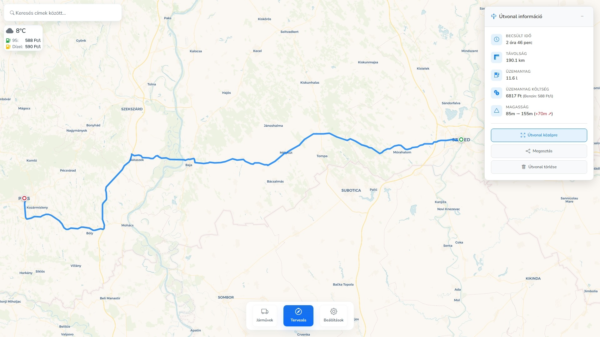
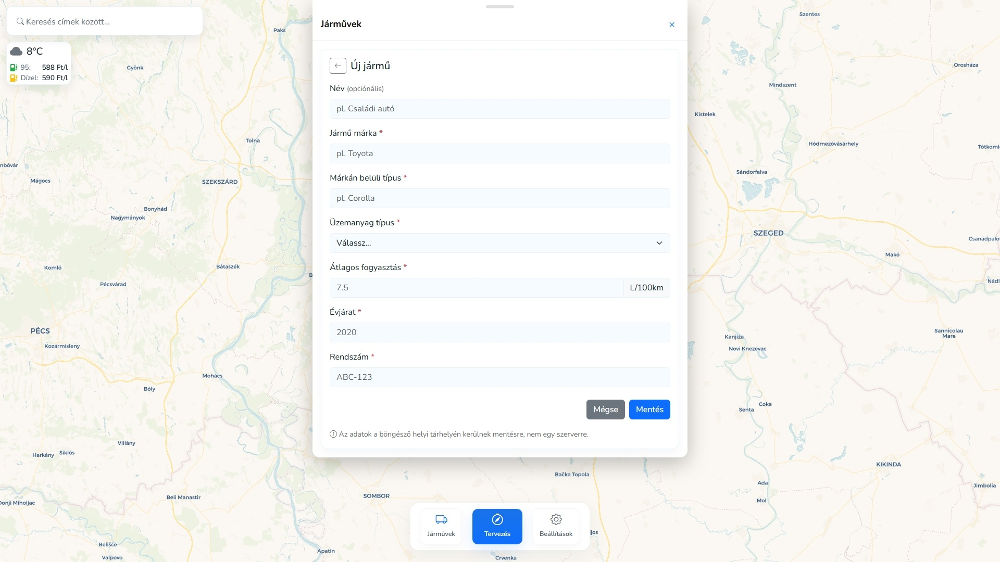
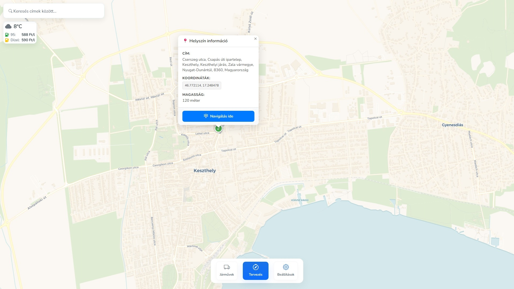

# DriveWise


**DriveWise** - Intelligent route planning application with fuel cost optimization, real-time weather data, and advanced vehicle management.

> **Note:** This project was created for testing purposes and is not under active development. The application features a Hungarian user interface and integrates Hungarian fuel price data, designed specifically for the Hungarian market.

## 🚗 Features

- **🗺️ Intelligent Route Planning** - Calculate optimal routes with real-time traffic data
- **⛽ Fuel Cost Calculator** - Real-time fuel prices and consumption calculations
- **🌤️ Weather Integration** - Current weather conditions along the route
- **🚙 Vehicle Management** - Manage multiple vehicle profiles with custom consumption data
- **📱 Progressive Web App (PWA)** - Mobile-friendly interface with offline support
- **🎨 Dark/Light Theme** - Automatic and manual theme switching
- **📍 GPS-based Location** - Automatic starting point detection
- **🔗 Route Sharing** - Share routes with encrypted links

## 📸 Screenshots

### Route Planning

*Plan routes between two points with detailed information including elevation difference, travel cost, fuel calculation, and more. The example shows a 190km route with 2h 46min travel time, 11.6L fuel consumption, and total cost of 6817 Ft.*

### Vehicle Management

*Manage your vehicles with custom settings including brand, model, fuel type, and consumption rates (e.g., 7.5 L/100km).*

### Location Information

*Tap any location to view detailed information including address, coordinates, and elevation. You can also navigate to that point from your current GPS location.*

## 🛠️ Technology Stack

- **Backend**: ASP.NET Core 9.0 (C#)
- **Frontend**: HTML5, CSS3, JavaScript (Vanilla)
- **APIs**: OpenWeatherMap, OSRM (route planning), holtankoljak.hu (fuel prices)
- **Containerization**: Docker & Docker Compose
- **Platforms**: Windows, macOS, Linux, Raspberry Pi (ARM64)

## 🚀 Quick Start

### Using Docker (Recommended)

```bash
git clone https://github.com/Xentinus/DriveWise.git
cd DriveWise
docker-compose up -d --build
```

Open in browser: `http://localhost:8800`

### Local Development

```bash
dotnet restore
dotnet run
```

### Using Management Script

```bash
./drivewise.sh
```

📖 **For detailed installation instructions, see [INSTALLATION.md](INSTALLATION.md)**

📖 **For management script documentation, see [MANAGEMENT_SCRIPT.md](MANAGEMENT_SCRIPT.md)**

## ⚙️ Configuration

### Weather API Setup (Optional)

1. Get a free API key from [OpenWeatherMap](https://openweathermap.org/api)
2. Copy `appsettings.Example.json` to `appsettings.json`
3. Update the API key:

```json
{
  "OpenWeatherMap": {
    "ApiKey": "YOUR_ACTUAL_API_KEY_HERE"
  }
}
```

**Note**: Without an API key, the application will use mock data.

## 🌐 API Endpoints

### Route Planning
```http
POST /api/routing/route
Content-Type: application/json

{
  "fromLat": 47.4979,
  "fromLon": 19.0402,
  "toLat": 47.5,
  "toLon": 19.05,
  "vehicle": {
    "name": "Car",
    "fuelType": "benzin",
    "consumption": 7.0
  }
}
```

### Other Endpoints
- `GET /api/fuelprice` - Get all fuel prices
- `GET /api/fuelprice/{type}` - Get specific fuel type price
- `GET /api/weather?lat={lat}&lon={lon}` - Get weather data
- `GET /api/location/search?query={query}` - Search locations
- `GET /api/location/details?lat={lat}&lon={lon}` - Get location details

## 📁 Project Structure

```
DriveWise/
├── Controllers/          # API controllers
│   ├── FuelPriceController.cs
│   ├── RoutingController.cs
│   ├── WeatherController.cs
│   └── LocationController.cs
├── Services/            # Business logic services
│   ├── FuelPriceService.cs
│   ├── RoutingService.cs
│   ├── WeatherService.cs
│   ├── VehicleService.cs
│   └── RouteShareService.cs
├── Models/              # Data models
│   ├── Vehicle.cs
│   ├── WeatherData.cs
│   └── LocationModels.cs
├── BackgroundServices/  # Background services
│   └── FuelPriceBackgroundService.cs
├── Views/               # Frontend views
│   └── Home/
├── wwwroot/            # Static files
│   ├── css/            # Stylesheets
│   ├── js/             # JavaScript modules
│   ├── manifest.json   # PWA manifest
│   └── sw.js           # Service Worker
└── Dockerfile          # Docker configuration
```

## 🔧 Developer Commands

```bash
# Build project
dotnet build

# Run tests
dotnet test

# Publish
dotnet publish

# Watch mode (automatic restart)
dotnet watch run
```

## 🐛 Troubleshooting

### Common Issues

**Port already in use**
```bash
# Change port in docker-compose.yml
ports:
  - "8801:8800"  # Use 8801 instead of 8800
```

**API Errors**
```bash
# View application logs
docker logs -f drivewise-app
```

**Fuel price API unavailable**
- Application automatically uses fallback data
- Background service retries every 30 minutes

**For detailed troubleshooting, see [INSTALLATION.md](INSTALLATION.md#troubleshooting)**

## 📱 PWA Features

- **Offline functionality**: Service Worker caching
- **Installable**: "Add to Home Screen" support
- **Responsive**: Mobile-first design
- **App-like experience**: Native application feel

## 🎨 Customization

### Themes
- Automatic dark/light mode
- System theme following
- Manual theme switching option

### Vehicles
- Custom consumption profiles
- Different fuel types (Benzin, Diesel, LPG, CNG)
- City/highway/mixed route calculations

## 📄 License

This project is licensed under the [MIT License](LICENSE).

## 📚 Documentation

- **[INSTALLATION.md](INSTALLATION.md)** - Detailed installation guide for all platforms
- **[MANAGEMENT_SCRIPT.md](MANAGEMENT_SCRIPT.md)** - Documentation for the unified management script

---

**DriveWise** - *Smart travel, optimal costs.* 🚗✨
